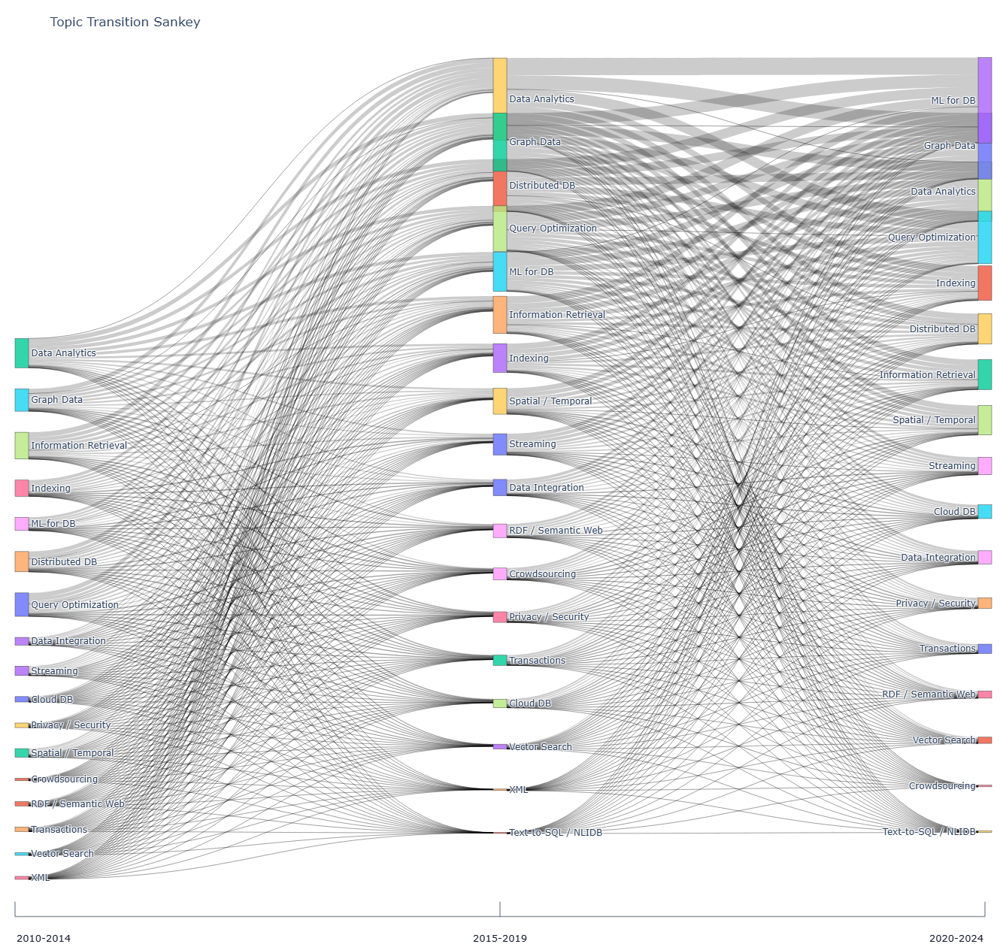
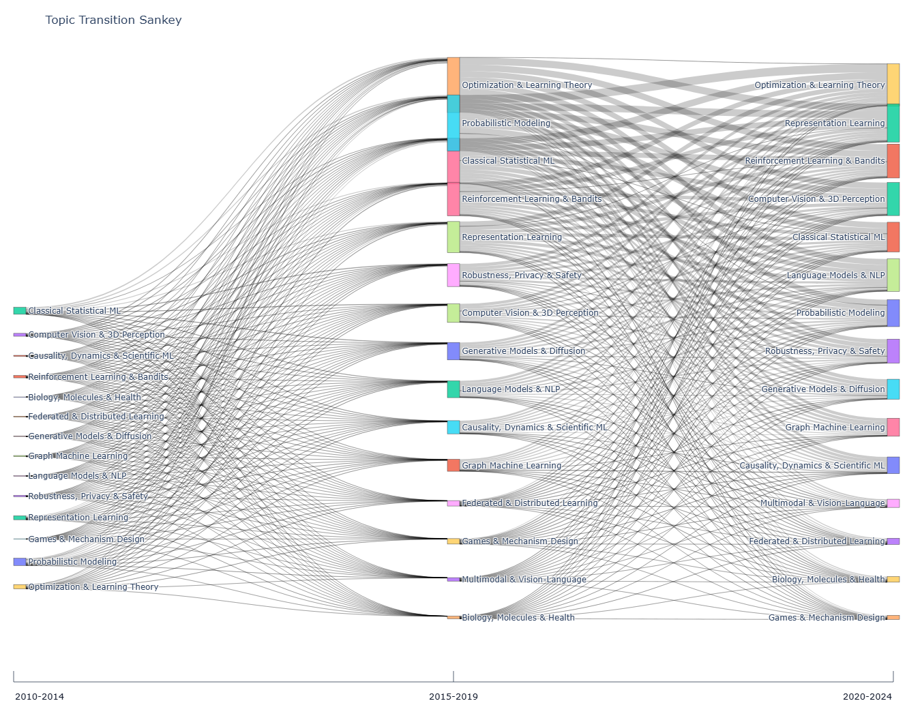

# Database and NeurIPS Topic Evolution Visualization

This subproject visualizes topic evolution from paper titles.

It currently supports two venue groups:

- `database`: VLDB / SIGMOD / PVLDB / PACMMOD
- `neurips`: NIPS / NeurIPS

The default analysis windows are:

- `2010-2014`
- `2015-2019`
- `2020-2024`


## Output Entry Points

- [outputs/html/index.html](outputs/html/index.html)
- [outputs/html/database/index.html](outputs/html/database/index.html)
- [outputs/html/neurips/index.html](outputs/html/neurips/index.html)


## Sankey Preview

Interactive database Sankey:

- [outputs/html/database/topic_transition_sankey.html](outputs/html/database/topic_transition_sankey.html)

Static database preview:



Interactive NeurIPS Sankey:

- [outputs/html/neurips/topic_transition_sankey.html](outputs/html/neurips/topic_transition_sankey.html)

Static NeurIPS preview:




## Pipeline Overview

The pipeline has the following stages.

### 1. Build a Reduced CSV

Large DBLP XML is kept outside the repository. A reduced CSV is created first and then reused offline.

Relevant script:

- [src/extract_dblp_xml_subset.py](src/extract_dblp_xml_subset.py)

Output columns:

```csv
title,year,venue,authors,dblp_url,doi
```

### 2. Assign Topics from Titles

Paper titles are matched against a venue-aware keyword dictionary.

Relevant scripts:

- [src/topic_dictionary.py](src/topic_dictionary.py)
- [src/extract_topics.py](src/extract_topics.py)

Notes:

- database venues and NeurIPS use different topic dictionaries
- multiple topics can be assigned to one paper
- unmatched papers are stored separately

### 3. Build Trends, Graphs, and Sankey Data

Relevant scripts:

- [src/build_graphs.py](src/build_graphs.py)
- [src/build_sankey.py](src/build_sankey.py)
- [src/visualize_pyvis.py](src/visualize_pyvis.py)
- [src/run_pipeline.py](src/run_pipeline.py)

Outputs are stored per venue group under dedicated directories.


## Output Structure

```text
data/
  raw/
    database/
      papers.csv
    neurips/
      papers.csv
  processed/
    database/
      papers.csv
      paper_topics.csv
    neurips/
      papers.csv
      paper_topics.csv

outputs/
  csv/
    database/
      topic_trend.csv
      topic_burst.csv
      sankey_nodes.csv
      sankey_edges.csv
      untagged_papers.csv
    neurips/
      topic_trend.csv
      topic_burst.csv
      sankey_nodes.csv
      sankey_edges.csv
      untagged_papers.csv
  gephi/
    database/
      topic_nodes_*.csv
      topic_edges_*.csv
    neurips/
      topic_nodes_*.csv
      topic_edges_*.csv
  html/
    index.html
    database/
      index.html
      topic_transition_sankey.html
      topic_network_2010-2014.html
      topic_network_2015-2019.html
      topic_network_2020-2024.html
    neurips/
      index.html
      topic_transition_sankey.html
      topic_network_2010-2014.html
      topic_network_2015-2019.html
      topic_network_2020-2024.html
```


## Sankey Definition

Each Sankey node is one `topic@period`.

- node label: topic name
- node size: frequency of the topic inside that period

Two edge types are used.

1. `persistence`

- same topic in adjacent periods
- weight = `min(count(topic, period_a), count(topic, period_b))`

2. `cooccurrence`

- cross-period topic-to-topic connections between adjacent periods
- built from topic sets observed in the left and right period

The Sankey is therefore a title-based topic transition approximation, not a citation or author transition graph.


## Current Cluster Coverage

Coverage is measured as:

- number of papers matched to at least one topic
- divided by all papers in the target venue group and year range

Current coverage for `2010-2024`:

Database:

- overall: `2553 / 3703 = 68.94%`
- `2010-2014`: `580 / 862 = 67.29%`
- `2015-2019`: `722 / 1026 = 70.37%`
- `2020-2024`: `1251 / 1815 = 68.93%`

NeurIPS:

- overall: `3376 / 4654 = 72.54%`
- `2010-2014`: `253 / 376 = 67.29%`
- `2015-2019`: `675 / 940 = 71.81%`
- `2020-2024`: `2448 / 3338 = 73.34%`


## How To Run

### 1. Install Dependencies

```bash
pip install -r requirements.txt
```

### 2. Extract a Reduced Database CSV from DBLP XML

```bash
python src/extract_dblp_xml_subset.py ^
  --xml-path "$HOME/work/gnn/dblp.xml" ^
  --output "$HOME/work/gnn/dblp_vldb_sigmod_2010_2024.csv" ^
  --start-year 2010 ^
  --end-year 2024 ^
  --progress-every 1000
```

### 3. Extract a Reduced NeurIPS CSV from DBLP XML

```bash
python src/extract_dblp_xml_subset.py ^
  --xml-path "$HOME/work/gnn/dblp.xml" ^
  --output "$HOME/work/gnn/dblp_neurips_2010_2024.csv" ^
  --start-year 2010 ^
  --end-year 2024 ^
  --venue-key nips ^
  --progress-every 1000
```

### 4. Generate Database Visualizations

```bash
python src/run_pipeline.py ^
  --start-year 2010 ^
  --end-year 2024 ^
  --manual-raw-file "data/raw/database/papers.csv" ^
  --period-start 2010 ^
  --period-end 2024 ^
  --period-size 5
```

### 5. Generate NeurIPS Visualizations

```bash
python src/run_pipeline.py ^
  --start-year 2010 ^
  --end-year 2024 ^
  --manual-raw-file "$HOME/work/gnn/dblp_neurips_2010_2024.csv" ^
  --venue-key nips ^
  --output-prefix neurips ^
  --period-start 2010 ^
  --period-end 2024 ^
  --period-size 5
```


## Notes

- topic assignment is keyword-based and title-only
- raw DBLP XML should stay outside the repository
- venue directories are now the primary organization unit for generated artifacts
- generated outputs are stored under `database/` and `neurips/`
