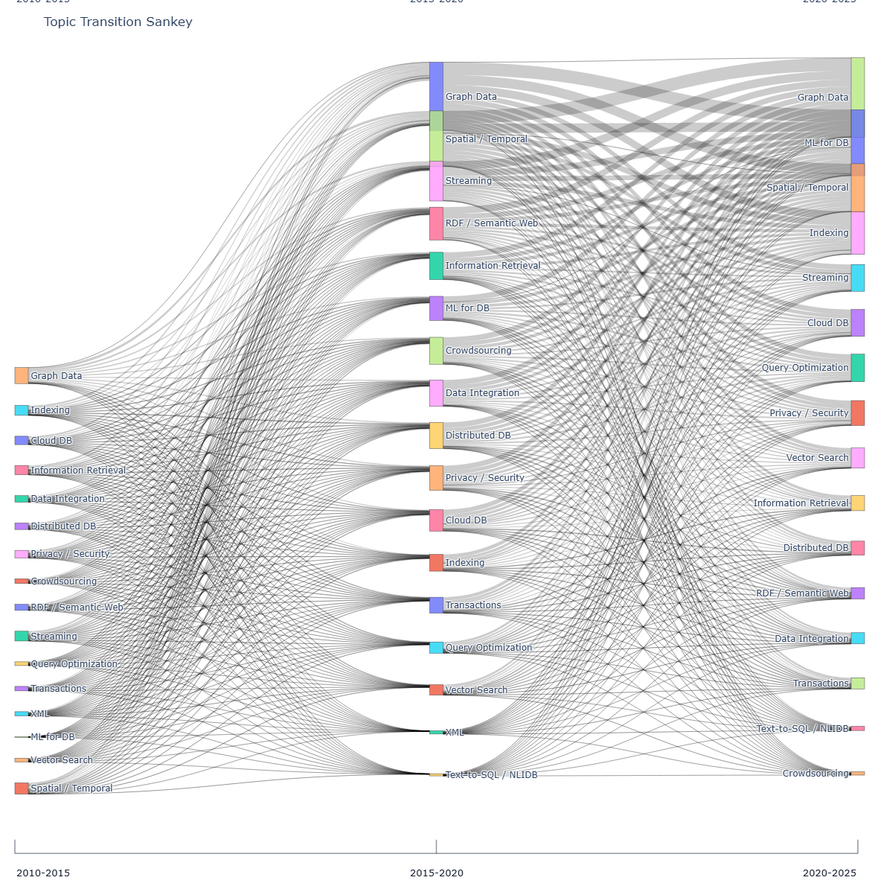

# VLDB/SIGMOD Topic Evolution Visualization

This subproject visualizes topic co-occurrence and topic transitions over time using paper titles from VLDB / SIGMOD / PVLDB / PACMMOD.

It generates two main kinds of visualizations:

- period-wise topic co-occurrence networks
- topic transition Sankey diagrams across periods


## Sankey Preview

The interactive Sankey diagram is available as HTML in the repository.

Interactive version:

- [GitHub Pages: Topic Transition Sankey](https://onizukalab.github.io/OnizukaLab/databaseResearchTrend/outputs/html/topic_transition_sankey.html)

Static preview:



## Pipeline Overview

The project builds the visualizations in the following stages.

### 1. Extract a Reduced CSV from DBLP XML

Instead of using the full `dblp.xml` directly, the pipeline first extracts only the target venues and target years into a reduced CSV.

Relevant script:

- [extract_dblp_xml_subset.py](src/extract_dblp_xml_subset.py)

What it does:

- scans only `article` / `inproceedings` records
- keeps only records whose `key` starts with:
  - `conf/sigmod/`
  - `conf/vldb/`
  - `journals/pvldb/`
  - `journals/pacmmod/`
- extracts `title`, `year`, `author`, and `ee`
- writes only papers in the year range `2010-2025`

Output CSV columns:

```csv
title,year,venue,authors,dblp_url,doi
```

### 2. Assign Topics from Paper Titles

Next, paper titles are matched against a keyword dictionary to assign topics.

Relevant scripts:

- [topic_dictionary.py](src/topic_dictionary.py)
- [extract_topics.py](src/extract_topics.py)

What it does:

- lowercases the title and performs phrase matching
- matches titles against the topic keyword dictionary
- allows multiple topics per paper
- writes untagged papers to `untagged_papers.csv`

Outputs:

- `data/processed/paper_topics.csv`
- `outputs/csv/untagged_papers.csv`

### 3. Compute Topic Trend and Burst Statistics

Topic trend and burst statistics are computed to capture how topics increase or decrease over time.

Relevant script:

- [build_graphs.py](src/build_graphs.py)

Outputs:

- `outputs/csv/topic_trend.csv`
- `outputs/csv/topic_burst.csv`

### 4. Build Period-wise Topic Co-occurrence Graphs

Topics that appear together in the same paper are connected as edges, producing a co-occurrence network for each period.

What it does:

- node: topic
- node size: frequency in the period
- edge: topic co-occurrence within the same paper
- edge weight: co-occurrence count

Outputs:

- `outputs/gephi/topic_nodes_*.csv`
- `outputs/gephi/topic_edges_*.csv`

### 5. Render Topic Networks with PyVis

The period-wise co-occurrence graphs are exported to interactive HTML with PyVis.

Relevant script:

- [visualize_pyvis.py](src/visualize_pyvis.py)

Outputs:

- `outputs/html/topic_network_2010-2015.html`
- `outputs/html/topic_network_2015-2020.html`
- `outputs/html/topic_network_2020-2025.html`

### 6. Build the Topic Transition Sankey Diagram

Finally, topic continuity and topic connections across periods are visualized as a Sankey diagram.

Relevant script:

- [build_sankey.py](src/build_sankey.py)

Sankey nodes:

- internally represented as `topic@period`
- displayed as topic labels only
- period labels are shown separately at the top of the figure

The Sankey uses two types of edges.

1. `persistence`

- created when the same topic appears in adjacent periods
- weight is `min(count(topic, period_a), count(topic, period_b))`

2. `cooccurrence`

- created from topic pairs appearing in paper sets from adjacent periods
- represented as `X@period_a -> Y@period_b`

### Node Size and Edge Construction

For the Sankey diagram, node size is determined by topic frequency within each period.

- each node corresponds to one `topic@period`
- the node weight is the number of tagged paper-topic rows assigned to that topic in that period
- in other words, a topic becomes visually larger when it appears more often in paper titles during that period

Edges are constructed in two different ways.

1. `persistence` edges

- created when the same topic appears in two adjacent periods
- edge weight = `min(count(topic in period_a), count(topic in period_b))`
- this encodes continuity of the same topic across time

2. `cooccurrence` edges

- created between topics from adjacent periods
- the implementation collects topic sets from papers in the left period and topic sets from papers in the right period
- for every pair of topic sets across the two periods, it adds cross-period topic pairs
- self-pairs are excluded here because they are already represented by `persistence`
- the final edge weight is the accumulated count of those cross-period topic-pair occurrences

This means the Sankey does not represent author-level or citation-level transition. It represents a title-level topic transition approximation based on adjacent-period topic presence and co-occurrence structure.

Outputs:

- `outputs/csv/sankey_nodes.csv`
- `outputs/csv/sankey_edges.csv`
- `outputs/html/topic_transition_sankey.html`

## How To Run

### 1. Install Dependencies

```bash
pip install -r requirements.txt
```

### 2. Extract a Reduced CSV from DBLP XML

The recommended workflow is to keep the large source XML outside the repository and generate a reduced CSV from it.

Example:

```bash
python src/extract_dblp_xml_subset.py ^
  --xml-path "$HOME/work/gnn/dblp.xml" ^
  --output "$HOME/work/gnn/dblp_vldb_sigmod_2010_2025_full.csv" ^
  --start-year 2010 ^
  --end-year 2025 ^
  --progress-every 1000
```

### 3. Generate the Visualizations from the Reduced CSV

```bash
python src/run_pipeline.py ^
  --start-year 2010 ^
  --end-year 2025 ^
  --manual-raw-file "$HOME/work/gnn/dblp_vldb_sigmod_2010_2025_full.csv"
```

## Main Outputs

- [outputs/html/index.html](outputs/html/index.html)
- [outputs/html/topic_transition_sankey.html](outputs/html/topic_transition_sankey.html)
- `outputs/html/topic_network_*.html`
- `outputs/csv/topic_trend.csv`
- `outputs/csv/topic_burst.csv`
- `outputs/csv/sankey_nodes.csv`
- `outputs/csv/sankey_edges.csv`

## GitHub Pages

If GitHub Pages is configured to publish from `main /docs`, the public entry point is:

- `https://onizukalab.github.io/databaseResearchTrend/`

The interactive HTML outputs are mirrored under:

- `https://onizukalab.github.io/databaseResearchTrend/outputs/html/index.html`
- `https://onizukalab.github.io/databaseResearchTrend/outputs/html/topic_transition_sankey.html`

## Repository Structure

```text
.
├── README.md
├── requirements.txt
├── .gitignore
├── src/
│   ├── extract_dblp_xml_subset.py
│   ├── fetch_dblp.py
│   ├── topic_dictionary.py
│   ├── extract_topics.py
│   ├── build_graphs.py
│   ├── build_sankey.py
│   ├── visualize_pyvis.py
│   ├── periods.py
│   └── run_pipeline.py
├── data/
│   ├── raw/
│   └── processed/
└── outputs/
    ├── csv/
    ├── gephi/
    └── html/
```

## Notes

- Topic assignment is keyword-based and title-only
- Abstracts, citation graphs, and embeddings are not used
- Sankey `cooccurrence` edges are an approximation of topic transition
- The repository is intended to store code and small artifacts, not the original large DBLP XML
